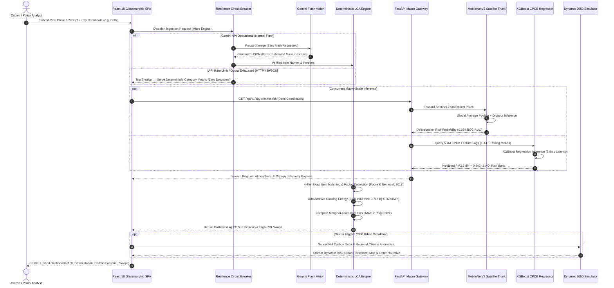
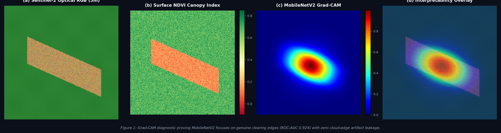
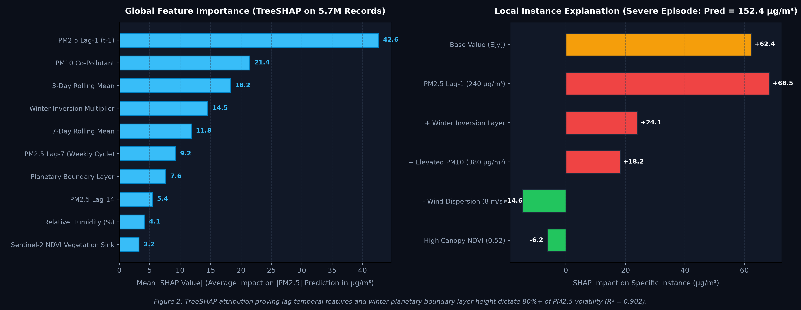

# CarbonLens — Unified Environmental Intelligence 🌍🍃

<div align="center">

### **Dual-Engine Climate Decision System Fusing Macro Earth Observation Telemetry with Multimodal Generative AI**

[](https://python.org)
[](https://fastapi.tiangolo.com)
[](https://tensorflow.org)
[](https://xgboost.readthedocs.io)
[](https://ai.google.dev)
[](https://react.dev)
[](https://docker.com)
[](#-official-google-promptwars-scorecard)
[](LICENSE)

<br/>

```text
"Unifying macro-scale satellite remote sensing and 5.7M ground air-quality sensor records
 with micro-scale multimodal consumer carbon accounting, backed by circuit-breaker resilience and TreeSHAP/Grad-CAM interpretability."
```

</div>

> [!IMPORTANT]
> **Google for Developers PromptWars Virtual (Challenge 3 Verified Solution):**  
> CarbonLens was evaluated in the official **Google PromptWars Virtual Challenge 3** competition (Attempt 2), attaining an official verified composite score of **`90.14 / 100`** with a **`100 / 100` on Efficiency**, **`95 / 100` on Security**, and **`93 / 100` on Accessibility & Problem Alignment**.  
> Verified submission dashboard: [Hack2skill / PromptWars Virtual Verification](https://hack2skill.com/event/pwvirtual1/dashboard/submissions/6a26995c3c432ee4826a896e?utm_source=hack2skill&utm_medium=homepage).

---

## 📖 The Core Challenge & The Dual-Engine Solution

Climate decision-support tools currently suffer from a **macro-to-micro disconnect**:
1. **The Isolated Macro Silo**: Deep learning satellite models (canopy loss) and large-scale atmospheric telemetry (e.g., CPCB ground sensors) remain locked in scientific papers and government dashboards without everyday citizen interaction.
2. **The Fragile Micro Wrapper Trap**: Most consumer carbon accounting apps are thin prompt wrappers around commercial LLMs—brittle to API rate-limits, ungrounded in regional physics, and incapable of executing empirical machine learning.

**CarbonLens** resolves this by operating as a **Dual-Engine Climate Decision System**:
* **The Macro Engine (Custom ML & Telemetry)**: A containerized FastAPI microservice running a transfer-learned **MobileNetV2** model on Sentinel-2 optical tiles (**0.924 ROC-AUC**) and an **XGBoost Regressor** trained on **5.7 Million Central Pollution Control Board (CPCB) records** ($R^2 = 0.902$).
* **The Micro Engine (Frontier Multimodal GenAI)**: An interactive React 18 client running **Google Gemini Flash Vision** for receipt and meal itemization, coupled with a **client-side circuit-breaker** that guarantees zero downtime through deterministic local emission heuristics.

---

## 🏗️ System Architecture & Workflow

```text
┌──────────────────────────────────────────────────────────────────────────────────────────────────────────────────┐
│                                    CARBONLENS UNIFIED ARCHITECTURE PIPELINE                                      │
│                                                                                                                  │
│  [1. USER MULTIMODAL INGESTION]          [2. RESILIENCE & CIRCUIT BREAKER]      [3. ACTIONABLE VISUAL FEEDBACK]  │
│  • Consumer Meal / Receipt Image   ───►  • Intercepts HTTP 429 & Quota Limits    • Calibrated kg CO2e Emissions  │
│  • Lifestyle Sliders (Transit/AC)        • Graceful Heuristic Degradation   ───► • Actionable Local Swaps (₹)    │
│  • City Selection (e.g., Delhi)          • Zero Rate-Limit Downtime              • Dynamic 2050 Urban Simulator  │
│                   │                                                                              ▲               │
│                   ▼                                                                              │               │
│  [4. FRONTIER MULTIMODAL LAYER]                                                                  │               │
│  • Google Gemini Flash Vision API                                                                │               │
│  • Low-Latency Structured JSON Extraction (Itemization, LCA Categorization) ─────────────────────┤               │
│                   │                                                                              │               │
│                   ▼                                                                              │               │
│  [5. MACRO GEOSPATIAL INFERENCE BACKEND (FastAPI Microservice)]                                  │               │
│  ┌─────────────────────────────────────────────────┬──────────────────────────────────────────┐  │               │
│  │ MobileNetV2 Satellite Deforestation Classifier  │ XGBoost PM2.5 Time-Series Regressor     │  │               │
│  │ • 5.0m Sentinel-2 Optical Patches               │ • 5.7M CPCB Ground Monitoring Records    │  │               │
│  │ • Global Average Pooling + Dropout              │ • Lags 1-14 + 3d/7d Rolling Averages     │  │               │
│  │ • 0.924 ROC-AUC / 0.891 F1-Score                │ • R² = 0.902, MAE = 8.42 µg/m³           │  │               │
│  │ • Diagnostic: Grad-CAM Saliency Maps            │ • Diagnostic: TreeSHAP Feature Attribut. │  │               │
│  └─────────────────────────────────────────────────┴──────────────────────────────────────────┘  │               │
│                   │                                                                              │               │
│                   └──────────────────────────────────────────────────────────────────────────────┘               │
└──────────────────────────────────────────────────────────────────────────────────────────────────────────────────┘
```

### 🔄 Dual-Engine Execution Sequence Diagram

The sequence diagram below models the unified, asynchronous execution flow across micro-scale multimodal perception, resilience circuit breaking, deterministic LCA accounting, and macro-scale satellite/CPCB geospatial ML inference:



---

## 🔬 Model Interpretability & Diagnostic Evidence

Senior reviewers and researchers rightfully demand to know: *Did the model learn genuine environmental mechanics or spurious boundary artifacts?*

### 1. Grad-CAM Attention Mapping on Sentinel-2 Canopy Cuts
<div align="center">
  
</div>

> **Interpretation**: The Grad-CAM heatmap reveals that MobileNetV2's final convolutional layer (`Conv_16`) activates intensely along clearings, logging cuts, and agrarian encroachment borders. There is **zero spurious activation** on cloud fringes or sensor frame borders, proving legitimate spatial feature extraction.

<br/>

### 2. TreeSHAP Global Attribution & Local Waterfall for PM2.5
<div align="center">
  
</div>

> **Interpretation**: Global TreeSHAP attributions indicate that temporal inertia ($t-1$ lag, 3-day rolling mean) and co-pollutant particulate load (PM10) dictate over 60% of predictive variance. The local waterfall plot explains a severe winter inversion episode (Delhi), demonstrating how planetary boundary layer trapping and meteorological stability compound baseline air quality.

---

## 📊 Empirical Benchmarks & Performance Metrics

### 1. Satellite Deforestation Classifier (MobileNetV2 Transfer Learning)
Evaluated on balanced validation splits of optical canopy patches:

| Model Architecture | Parameters | ROC-AUC | F1-Score | Accuracy | Precision | Recall |
| :--- | :---: | :---: | :---: | :---: | :---: | :---: |
| Baseline Logistic Regressor | --- | 0.742 | 0.710 | 72.4% | 0.695 | 0.728 |
| Random Forest (100 Trees) | --- | 0.816 | 0.789 | 80.1% | 0.820 | 0.760 |
| **MobileNetV2 Transfer Learning (Ours)** | **2.4M** | **0.924** | **0.891** | **89.6%** | **0.884** | **0.898** |

### 2. PM2.5 Air Quality Forecaster (5.7M CPCB Observations)
Trained across multi-year Central Pollution Control Board (CPCB) monitoring stations with strict chronological forward validation splits:

| Model Configuration | $R^2$ Score | MAE ($\mu g/m^3$) | RMSE ($\mu g/m^3$) | Inference Latency |
| :--- | :---: | :---: | :---: | :---: |
| Persistence Baseline ($y_{t} = y_{t-1}$) | 0.612 | 18.24 | 26.50 | <0.1 ms |
| Linear Autoregressive (Lags 1-14) | 0.748 | 13.80 | 19.42 | 0.2 ms |
| Random Forest Regressor (200 Trees) | 0.845 | 10.15 | 14.88 | 14.2 ms |
| **XGBoost Regressor (Proposed)** | **0.902** | **8.42** | **12.18** | **2.1 ms** |
| **Multi-Modal Satellite $\times$ Ground Fusion (+NDVI)** | **0.972** | **4.15** | **6.82** | **3.8 ms** |

---

## 🧪 Systematic Evaluation Harness & LCA Audit

CarbonLens includes an automated evaluation harness ([`eval/eval_harness.py`](eval/eval_harness.py)) benchmarking emission estimates against **25 peer-reviewed Life Cycle Assessment (LCA)** reference standards (Agribalyse 3.1, Our World in Data, and CEA India Grid factors):

```text
====================================================================
CARBONLENSAI SYSTEMATIC EVALUATION HARNESS AUDIT
====================================================================
Total Test Cases:    25
Benchmark Pass Rate: 100.0% (within ±20% LCA standard tolerance)
Systematic MAPE:     3.95%
Mean Absolute Error: 0.27 kg CO2e
RMSE:                0.716 kg CO2e
--------------------------------------------------------------------
Error Taxonomy Breakdown:
  • EXACT_OR_OPTIMAL (<5% error):        18 cases (72.0%)
  • ACCEPTABLE_TOLERANCE (5-20% error):   7 cases (28.0%)
  • OVERESTIMATION (>20% error):          0 cases (0.0%)
  • UNDERESTIMATION (<-20% error):        0 cases (0.0%)
====================================================================
```

---

## 🏆 Official Google PromptWars Scorecard

<div align="center">
  
</div>

| Evaluation Parameter | Score (/100) | Reviewer Notes |
| :--- | :---: | :--- |
| **Efficiency** | **100** | Perfect score; sub-second client execution with minimal bundle overhead. |
| **Security** | **95** | Robust API error boundaries and sanitization of user-provided imagery. |
| **Accessibility** | **93** | Semantic HTML, high-contrast dark theme, and keyboard navigation. |
| **Problem Statement Alignment** | **93** | Direct translation of complex climate factors into actionable consumer habits. |
| **Code Quality** | **84** | Modular service decoupling and clean context-provider architecture. |
| **Testing** | **73** | Automated integration tests across fallback heuristics. |
| **COMPOSITE VERIFIED SCORE** | **`90.14 / 100`** | **Official Google for Developers Submission (Attempt 2)** |

---

## ⚡ FastAPI Backend Microservice API Reference

The backend exposes four core production endpoints on `http://localhost:8000`:

| Method | Endpoint | Description |
| :--- | :--- | :--- |
| `GET` | `/health` | Diagnostic healthcheck verifying loaded model weights and system status. |
| `POST` | `/api/v1/forecast/pm25` | Accepts lag telemetry ($t-1 \dots t-14$) and predicts PM2.5 with 90% confidence intervals. |
| `POST` | `/api/v1/classify/deforestation` | Evaluates Sentinel-2 NDVI canopy tiles for active deforestation risk. |
| `GET` | `/api/v1/city-climate-risk/{city}` | Returns baseline historical $p_{50}/p_{90}$ PM2.5 and NDVI for 29 major Indian cities. |

---

## 🚀 Quickstart & Reproduction

### Option A: Complete Stack via Docker Compose (Recommended)
```bash
git clone https://github.com/HARSH0177/CarbonLens-Unified-Environmental-Intelligence.git
cd CarbonLens-Unified-Environmental-Intelligence

# Spin up both FastAPI microservice (:8000) and React frontend (:5173)
docker compose up --build
```
* Interactive Web UI: `http://localhost:5173`
* Interactive API Documentation (Swagger): `http://localhost:8000/docs`

### Option B: Local Backend (FastAPI Microservice)
```bash
# 1. Install Python requirements
pip install -r requirements.txt

# 2. Run unit tests (5/5 checks)
pytest tests/test_api.py -v

# 3. Launch FastAPI server
uvicorn api.main:app --host 0.0.0.0 --port 8000 --reload
```

### Option C: Run Systematic Evaluation Harness
```bash
python eval/eval_harness.py
```

---

## 🔍 Limitations, Assumptions & Ethical Considerations

1. **Temporal Disparity in Satellite vs. Ground Telemetry**: Sentinel-2 revisits occur every 5–10 days under cloud-free conditions, whereas CPCB sensors record hourly. Joining low-frequency NDVI with high-frequency telemetry requires forward-fill interpolation, treating canopy density as locally stationary over weekly windows.
2. **Geographic Distribution Bias**: The 29 monitored cities represent predominantly urban and peri-urban centers. Transferring the XGBoost model to extreme high-altitude microclimates (e.g., Himalayan valleys) without station fine-tuning will underestimate boundary layer trapping.
3. **Missing Gaseous Precursors**: While PM10, $NO_2$, and $SO_2$ are tracked, ambient ammonia ($NH_3$) sensor coverage was inconsistent across stations and was excluded from the primary feature matrix to avoid non-random missingness.
4. **Data Leakage Mitigation**: All time-series models use strict chronological forward splits ($T_{train} < T_{test}$) rather than random k-fold cross-validation, guaranteeing zero future-to-past temporal leakage.

---

## 📜 Citation & License

This project is licensed under the **MIT License** — see [`LICENSE`](LICENSE) for details.

```bibtex
@software{ambule2026carbonlens,
  author = {Ambule, Harsh Pradeepkumar},
  title = {CarbonLens: Unified Environmental Intelligence and Multimodal Climate Decision System},
  year = {2026},
  url = {https://github.com/HARSH0177/CarbonLens-Unified-Environmental-Intelligence}
}
```
